# *Fusarium graminearum* PH-1 — Light-Regime RNA-seq Differential Expression

RNA-seq processing and differential expression for *Fusarium graminearum* PH-1
grown under four light regimes, mapped to the **NCBI RefSeq** reference genome
and annotation (assembly `GCF_000240135.3`, ASM24013v3) using native
**FGSG_ gene IDs**. Differential expression is reported three ways — from raw
read counts (DESeq2) and from TPM and FPKM (limma-trend) — for **all six
pairwise contrasts**.

## Experimental design

| Condition | Code | Description | Replicates |
|-----------|------|-------------|------------|
| Control   | H    | Half/half — 12 h light / 12 h dark (**reference level**) | H13_S7, H14_S8, H15_S9 |
| Black light | B  | Black light | B10_S1, B11_S2, B12_S3 |
| Dark light | D   | Dark light | D10_S4, D11_S5, D12_S6 |
| Low light | L    | Low light | L13_S10, L14_S11, L15_S12 |

12 paired-end libraries (~101 bp), 3 biological replicates per condition.

## Pipeline

```
FASTQ
  │  fastp 1.1.0            adapter/quality trim (Q20, len≥36, --detect_adapter_for_pe)
  ▼
trimmed reads
  │  HISAT2 2.2.2           --rna-strandness RF --dta, spliced align to NCBI genome
  ▼
sorted BAMs (samtools 1.22.1)
  ├─ featureCounts 2.1.1    -p --countReadPairs -s 2 -t exon -g gene_id  → raw counts
  └─ StringTie 3.0.3        -e -B --rf                                    → TPM, FPKM
  ▼
gene × sample matrices (13,725 gene models × 12 libraries, FGSG_ IDs)
  ├─ DESeq2 (R 4.5.3)       raw counts, Wald test + apeglm shrinkage
  ├─ limma-trend            log2(TPM+1),  eBayes(trend=TRUE, robust=TRUE)
  └─ limma-trend            log2(FPKM+1), eBayes(trend=TRUE, robust=TRUE)
  ▼
DE tables · VST clustered heatmaps · hypergeometric GO enrichment (blast2go GAF)
```

**Significance threshold (all methods):** adjusted *p* < 0.05 **and** |log2FC| ≥ 1.
Positive log2FC = up in the first-named condition of each contrast.

## Quality control

QC is strong: **PC1 captures 80%** of variance (PC2 10.4%), within-condition
replicate correlation r ≈ 0.99 (0.928–0.993 overall), and samples cluster
cleanly by light regime. Per-library alignment rate ~97.5%. One library,
**B12_S3**, shows 30% multimapping (a known property of that library) and the
smallest DESeq2 size factor (0.648); it was retained, and multimapping reads
were excluded from counting.

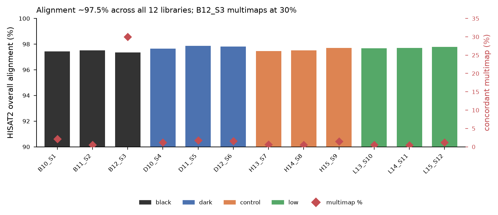
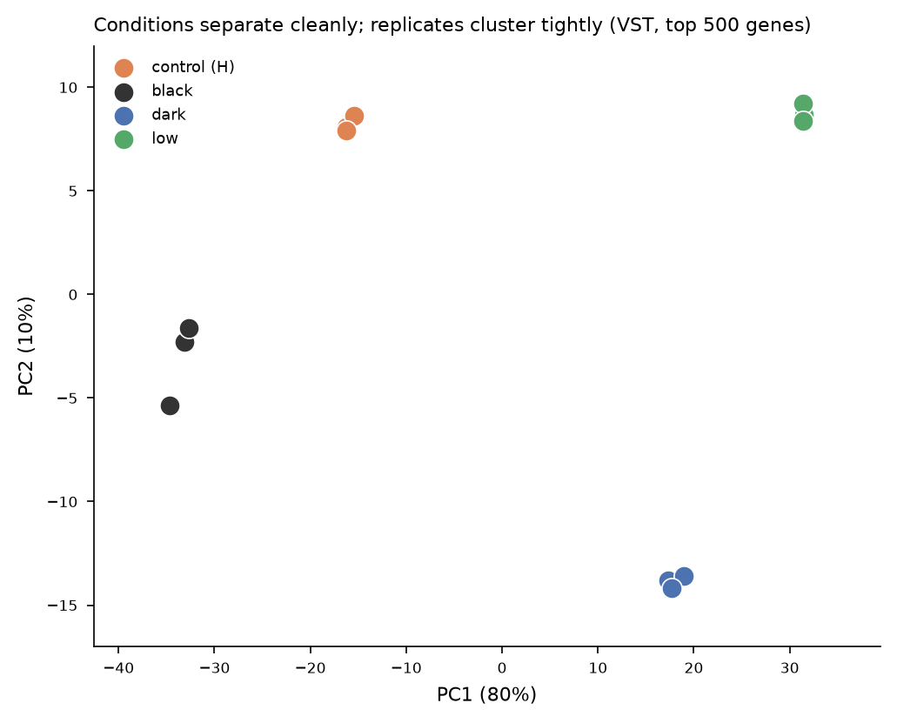
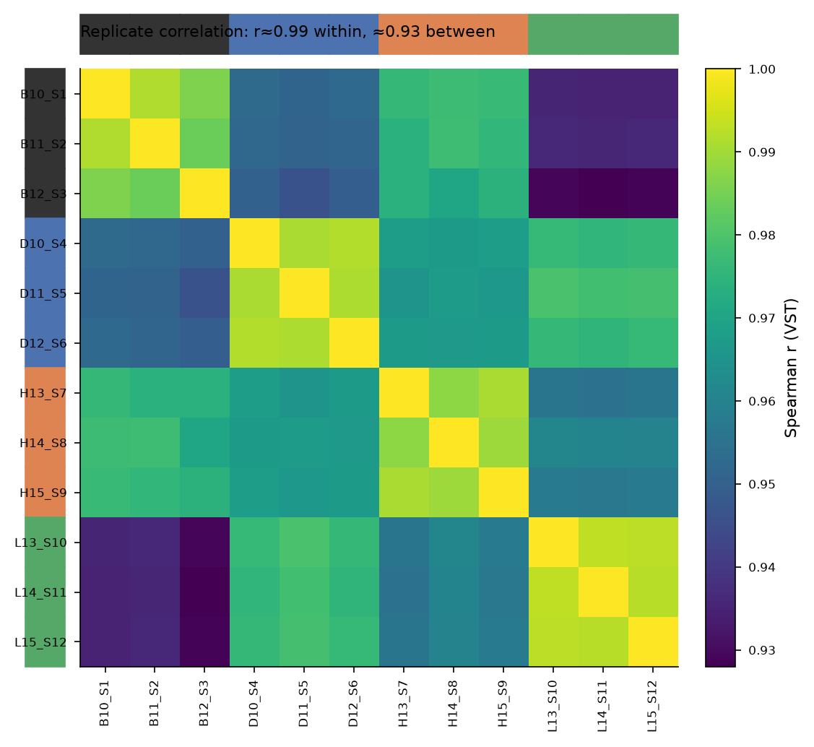
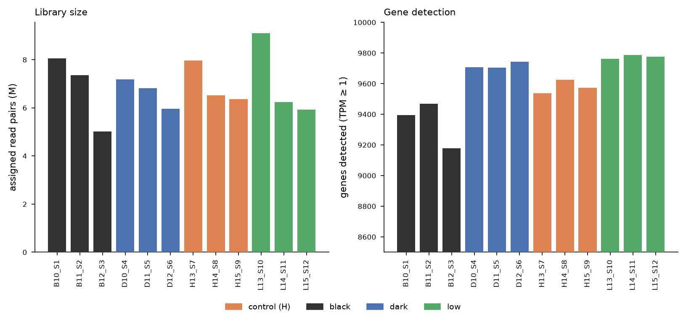

## Differential expression

DEG counts per contrast (padj < 0.05 & |log2FC| ≥ 1):

| Contrast (B vs A) | DESeq2 (counts) | limma (TPM) | limma (FPKM) |
|-------------------|:---------------:|:-----------:|:------------:|
| dark_light vs black_light  | 1,989 | 1,965 | 1,743 |
| control vs black_light     |   753 |   780 |   639 |
| low_light vs black_light   | 2,721 | 2,877 | 2,681 |
| control vs dark_light      | 1,219 | 1,116 |   950 |
| low_light vs dark_light    |   631 |   617 |   526 |
| low_light vs control       | 1,639 | 1,634 | 1,436 |

Across DESeq2 contrasts: **3,525 unique DEGs**; 479 shared across the three
light-vs-black contrasts; **42 DE in all six**. The three quantification
methods agree well — pooled DESeq2-vs-limma(TPM) log2FC Pearson r = **0.94**,
with 48–65% three-way overlap of significant genes per contrast.

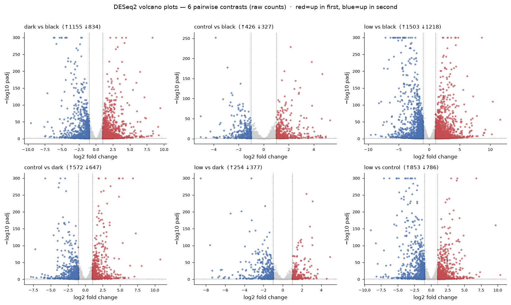
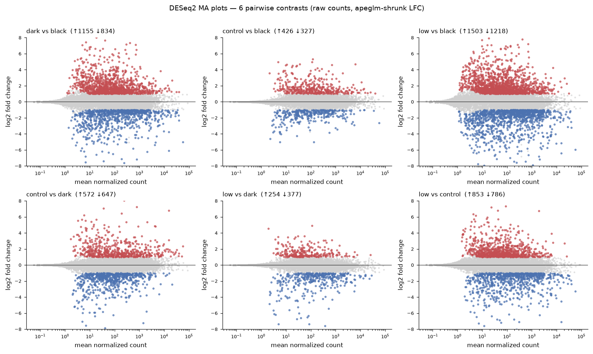
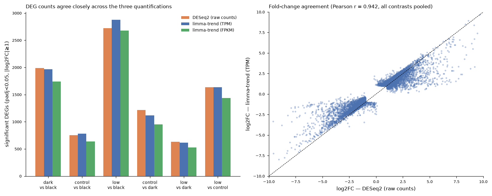

## Expression heatmaps

Clustered heatmaps built from VST-transformed raw counts across **all 12,723
expressed gene models**, row z-scored, Ward hierarchical clustering on both axes.

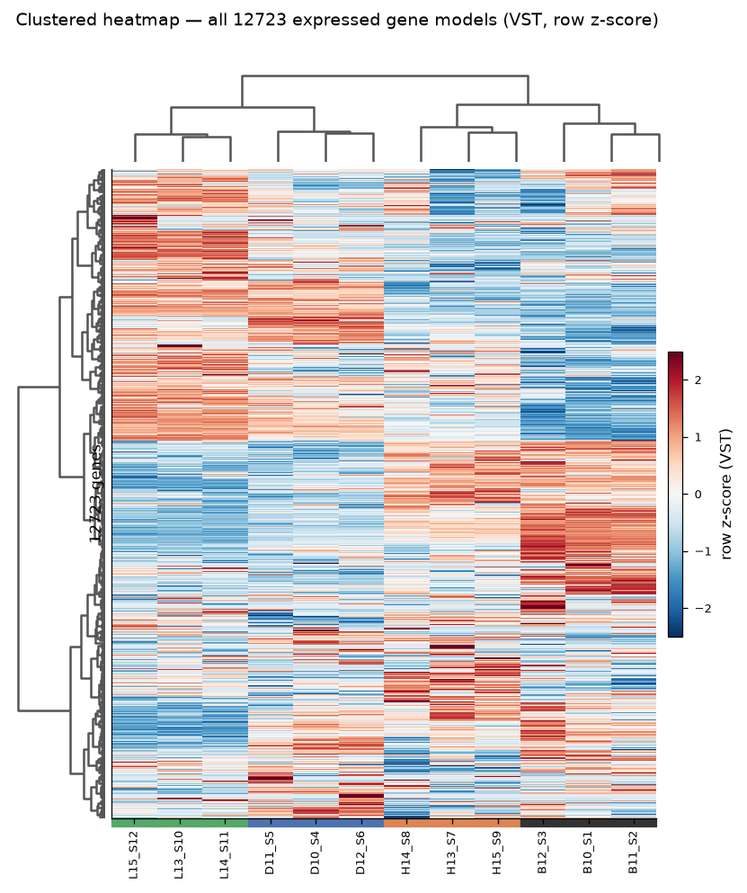
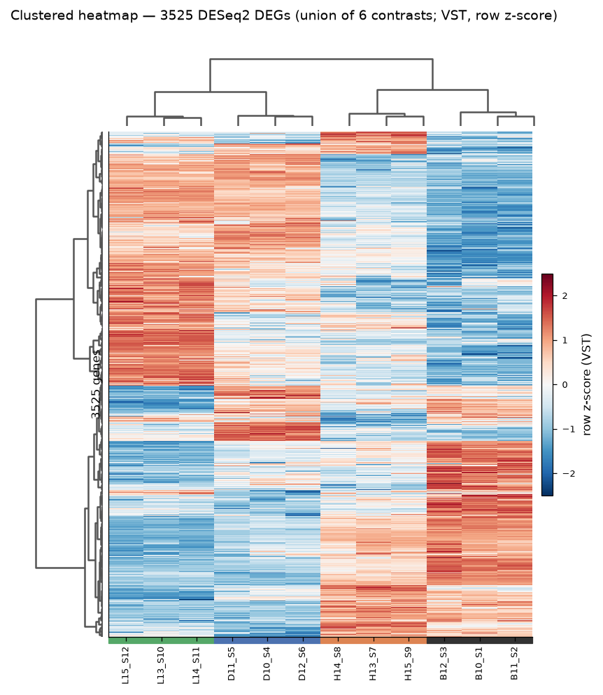
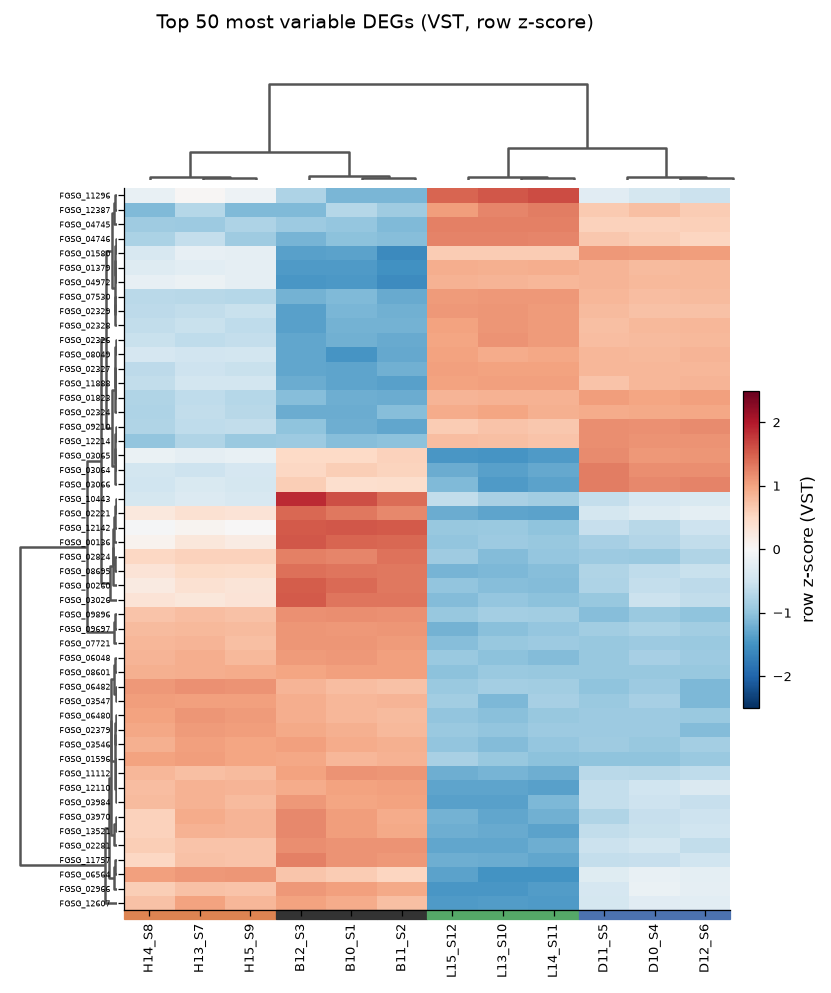

## GO enrichment

Hypergeometric over-representation against the OmicsBox blast2go GAF
(20230802), BP/MF/CC tested separately, BH-FDR, background = genes tested in
each contrast. **168 significant GO terms** (padj < 0.05) across the six
contrasts. The dominant enriched theme is oxidation-reduction (P450 /
monooxygenase, heme/iron binding, catalase / hydrogen-peroxide catabolism —
oxidative-stress detoxification) plus amino-acid transport.

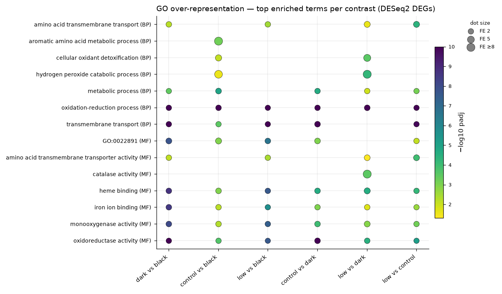

## Genes of interest & treatment-vs-control overlap

257 publication-derived genes of interest — all 257 present in the NCBI
reference — were cross-referenced against the DE results; **141 are DEG in ≥1
contrast**. Treatment-vs-control DEG overlap (DESeq2): union 2,369 genes,
**197 DEG in all three treatments** vs control.

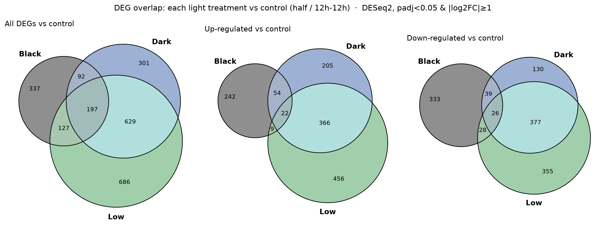

## Repository layout

### Documentation
- [docs/README_ncbi_analysis.md](docs/README_ncbi_analysis.md) — detailed methods report

### Reference (`data/reference/`)
- [ref_gene_table.csv](data/reference/ref_gene_table.csv) — gene_id, chrom, coords, biotype, product
- [tx2gene.tsv](data/reference/tx2gene.tsv) — transcript→gene map
- [fgsg_go_map.tsv](data/reference/fgsg_go_map.tsv) — gene→GO (from blast2go GAF)
- [go_term_names.tsv](data/reference/go_term_names.tsv) — GO ID→name (EBI QuickGO)

### Expression matrices (`data/matrices/`) — 13,725 gene models × 12 libraries
- [raw_counts.csv](data/matrices/raw_counts.csv) — featureCounts raw counts
- [tpm_matrix.csv](data/matrices/tpm_matrix.csv) — StringTie TPM
- [fpkm_matrix.csv](data/matrices/fpkm_matrix.csv) — StringTie FPKM
- [normalized_counts.csv](data/matrices/normalized_counts.csv) — DESeq2 median-of-ratios
- [vst_matrix.csv](data/matrices/vst_matrix.csv) — variance-stabilized (heatmap input)

### QC (`results/qc/`)
- [fastp_summary.csv](results/qc/fastp_summary.csv) · [hisat2_alignment_summary.csv](results/qc/hisat2_alignment_summary.csv)

### Differential expression
- DESeq2 (raw counts): [`results/de_deseq2/`](results/de_deseq2/) — 6 per-contrast tables + [DE_summary_counts.csv](results/de_deseq2/DE_summary_counts.csv) + [all_significant_DEGs_long.csv](results/de_deseq2/all_significant_DEGs_long.csv)
- limma-trend (TPM): [`results/de_tpm/`](results/de_tpm/) — 6 tables + [DE_summary_tpm.csv](results/de_tpm/DE_summary_tpm.csv)
- limma-trend (FPKM): [`results/de_fpkm/`](results/de_fpkm/) — 6 tables + [DE_summary_fpkm.csv](results/de_fpkm/DE_summary_fpkm.csv)
- Cross-method: [results/concordance/method_concordance.csv](results/concordance/method_concordance.csv)

### GO enrichment (`results/go/`)
- [GO_enrichment_all_contrasts.csv](results/go/GO_enrichment_all_contrasts.csv) · [GO_enrichment_significant.csv](results/go/GO_enrichment_significant.csv) + 6 per-contrast tables

### Genes of interest (`results/genes_of_interest/`)
- [GOI_expression_DESeq2_6contrasts.xlsx](results/genes_of_interest/GOI_expression_DESeq2_6contrasts.xlsx) — 6 contrasts, DESeq2
- [GOI_expression_template_3contrasts_FPKM.xlsx](results/genes_of_interest/GOI_expression_template_3contrasts_FPKM.xlsx) — CLC-style template, 3 contrasts, FPKM
- [GOI_expression_all_methods_6contrasts.xlsx](results/genes_of_interest/GOI_expression_all_methods_6contrasts.xlsx) — 6 contrasts × 3 methods
- [GOI_expression_long_all_methods.csv](results/genes_of_interest/GOI_expression_long_all_methods.csv) · [GOI_overlap_by_category.csv](results/genes_of_interest/GOI_overlap_by_category.csv)

### Venn membership (`results/venn/`)
- [venn_treatment_vs_control_membership.csv](results/venn/venn_treatment_vs_control_membership.csv)

### Figures (`figures/`)
All 12 PNGs referenced above.

## Tool versions

fastp 1.1.0 · HISAT2 2.2.2 · samtools 1.22.1 · subread/featureCounts 2.1.1 ·
StringTie 3.0.3 · DESeq2 (R 4.5.3) + apeglm · limma · pheatmap

## License

Released under the MIT License — see [LICENSE](LICENSE).
